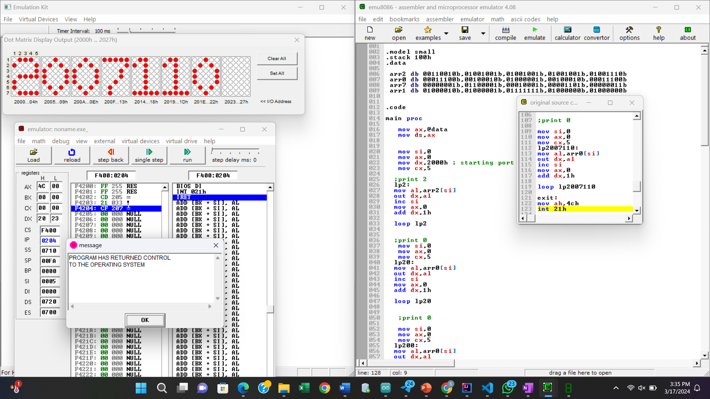

# Procedure
1. Install Emu8086
2. Download EmulationKit.zip file from my github
3. UnZip it
4.  paste Emulation_Kit.exe in  C:\emu8086\DEVICES
5.  To use the display emu8086>run> virtual devices > Emulation_Kit.exe
6.  Demo code in dotmatrix_roll_print.asm
   
